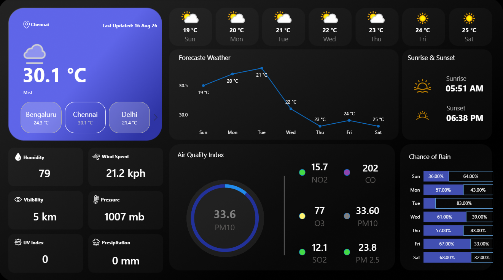

# WeatherPulse — API-Powered Weather Analytics Dashboard

## Project Overview

WeatherPulse is a weather analytics project that uses a free weather API as an external source of weather data and Microsoft Power BI for data transformation, modeling, analysis and visualization. It analyzes current weather conditions, daily forecasts, hourly forecasts, precipitation, wind, atmospheric conditions and air-quality information.

## Dashboard Preview

## Features

* Current weather monitoring
* Multi-location weather comparison
* Daily forecast analysis
* Hourly forecast analysis
* Temperature analysis
* Rain probability and precipitation
* Wind and atmospheric conditions
* Air-quality analysis
* Sunrise and sunset information
* Interactive Power BI dashboard

## Tech Stack

* Free Weather API
* Microsoft Power BI
* Power Query
* Microsoft Excel
* API-based data collection
* Data transformation and visualization

## Data Workflow

Weather API
↓
Data Collection
↓
Data Transformation
↓
Structured Excel Datasets
↓
Power BI Data Model
↓
Interactive Dashboard

## Project Files

### PowerBI/

Contains the main `.pbix` Power BI project.

### Data/

Contains:

* Current.xlsx — current weather data
* Forecast_Day.xlsx — daily forecast data
* Forecast_Hour.xlsx — hourly forecast data
* MasterReport.xlsx — combined reporting dataset

### Documentation/

Contains the detailed project documentation.

### Screenshots/

Contains dashboard screenshots used for the project preview.

## API Security

API credentials are sensitive and must not be committed to a public repository. Any API key used during development is protected and securely stored outside of this project repository.

## Future Improvements

* Automated API refresh
* Historical weather analysis
* Weather alerts
* Forecast vs actual analysis
* Power BI Service deployment
* Secure API credential management
